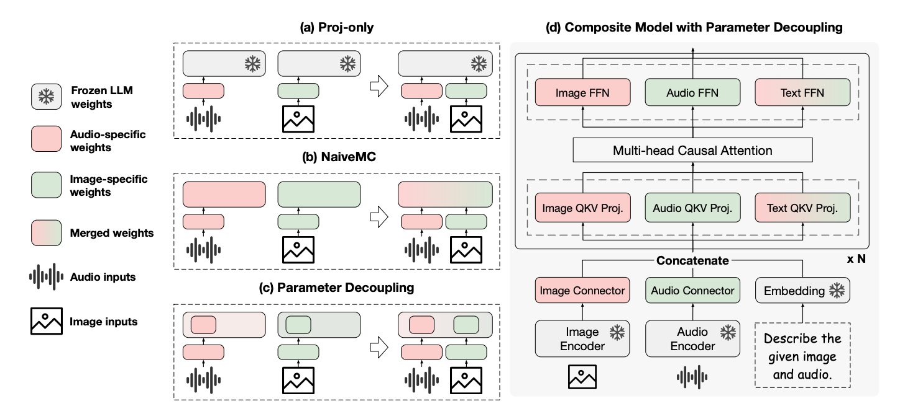
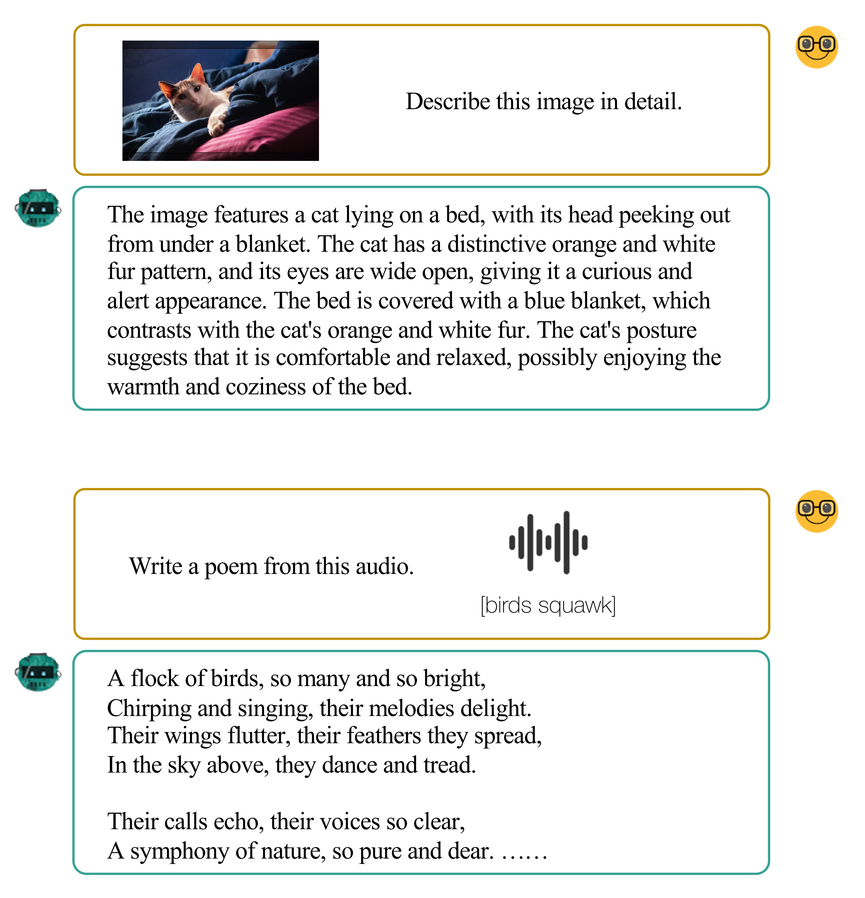
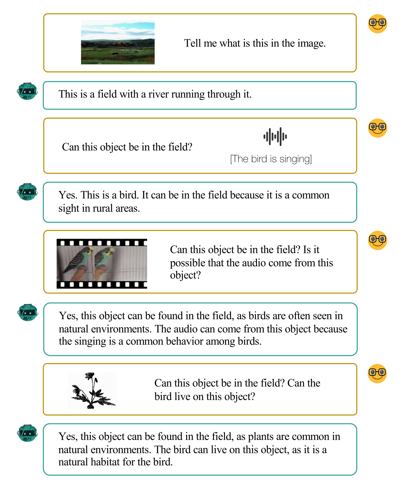

## Abstract

Recent developments in Multimodal Large Language Models (MLLMs) have shown rapid progress, moving towards the goal of creating versatile MLLMs that understand inputs from various modalities. However, existing methods typically rely on joint training with paired multimodal instruction data, which is resource-intensive and challenging to extend to new modalities. In this paper, we propose a new paradigm through the model composition
of existing MLLMs to create a new model that retains the modal understanding capabilities of each original model. Our basic implementation, **NaiveMC**, demonstrates the effectiveness of this paradigm by reusing modality encoders and merging LLM parameters. Furthermore, we introduce **DAMC** to address parameter interference and  mismatch issues during the merging process, thereby enhancing the model performance. To facilitate research in this area, we propose **MCUB**, a benchmark for assessing ability of MLLMs to understand inputs from diverse modalities. Experiments on this benchmark and four other multimodal understanding tasks show significant improvements over baselines, proving that model composition can create a versatile model capable of processing inputs from multiple modalities.

## Methodology

   <div style="text-align:center;">
      
   </div>

   <div style="text-align:center;margin-bottom: 2rem">
      <font size=3> Figure 1: Illustration of the model composition processes with only image and audio modalities are considered for simplicity. (a) and (b) show a basic model composition framework, while (c) and (d) demonstrate model composition with parameter decoupling</font>
      <br>
   </div>

### A Model Composition Framework

In our composition framework, we retain all modal-specific components (and their weights) from different MLLMs to handle respective modal inputs, and connect them to the same LLM. In cases where the LLMs have not been adapted during the training of MLLMs (as illustrated in the Figure 1(a)), we employ the pre-trained  weights of the LLM directly. Conversely, if the LLMs have undergone adaptation in the MLLM training process (Figure 1(b)), we simply average their weights. We name this composition framework NaiveMC and provide a formal procedure of it in Algorithm 1.

   <div style="text-align:center;">
      
   </div>

### Parameter Decoupling

To address the potential for parameter interference when merging fine-tuned LLM parameters, we advocate for initially training the MLLMs with a parameter decoupling strategy in the first place. As shown in Figure 1(c) and Figure 1(d), the main idea is to separate the modality processing parameters from those of the language model within MLLMs. When composing MLLMs that are trained through parameter decoupling, we merge only the text-related parameters, maintaining distinct modality-specific parameters as depicted in Figure 1(d). By doing so, it effectively mitigates the risk of interference from other modalities, ensuring that the composite model maintains high fidelity in processing multimodal data. At the same time, after the MLLMs are trained, the composition phase remains emphatically training-free.

### Adaptive Parameter Adjustment

For models trained using parameter decoupling, we can additionally adjust their modality-specific parameters if needed. The values of these coefficients can be determined with a validation set from target tasks requiring various modal inputs. If such a validation set is not available, a practical alternative is to select the coefficients based on general performance of the model on tasks of each modality. We refer to the updated model composition framework with parameter decoupling and adjustment as **DAMC**.

### Multimodal Commonality Understanding Benchmark

   <div style="text-align:center;">
      
   </div>

To demonstrate the effectiveness of our approach on tasks involving numerous modalities, inspired by Panagopoulou et al. (2023)(https://arxiv.org/pdf/2402.12750.pdf), we introduce a new benchmark called the Multimodal Commonality Understanding Benchmark **(MCUB)**. We provide an example of MCUB in the figure above.

## Qualitative Results

   <div style="text-align:center;margin-bottom: 2rem">
      
   </div>

   <div style="text-align:center;margin-bottom: 2rem">
      
   </div>

   <div style="text-align:center;margin-bottom: 2rem">
      
   </div>

   <div style="text-align:center;margin-bottom: 2rem">
      
   </div>

   <div style="text-align:center;">
      
   </div>

## Contact

This project is co-led by [Chi Chen](https://carboncoo.github.io), [Yiyang Du](https://adu2021.github.io), and is advised by [Peng Li](https://www.lpeng.net/) (lipeng@air.tsinghua.edu.cn) and [Yang Liu](https://nlp.csai.tsinghua.edu.cn/~ly) (liuyang2011@tsinghua.edu.cn).

## Citation
```
@article{chen2024model,
  title={Model Composition for Multimodal Large Language Models},
  author={Chen, Chi and Du, Yiyang and Fang, Zheng and Wang, Ziyue and Luo, Fuwen and Li, Peng and Yan, Ming and Zhang, Ji and Huang, Fei and Sun, Maosong and others},
  journal={arXiv preprint arXiv:2402.12750},
  year={2024}
}
```