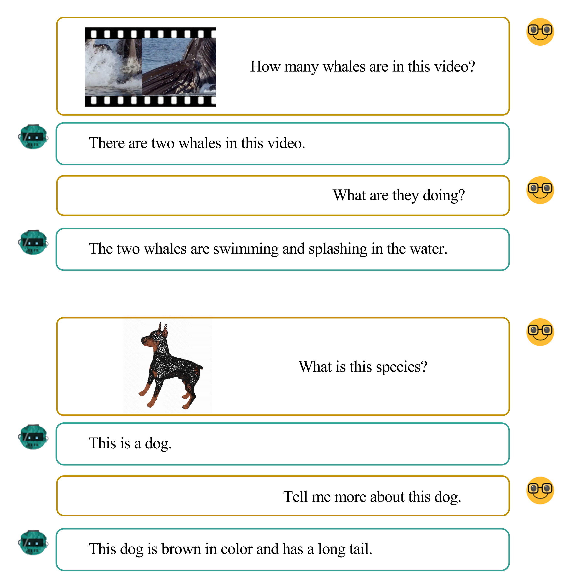

<span style="font-size:1.6rem; margin-top: 2rem; margin-bottom: 1rem; font-weight: normal; color: #6f86d6;">Overview</span>

Recent developments in Multimodal Large Language Models (MLLMs) have shown rapid progress. However, existing methods typically rely on joint training with paired multimodal instruction data. So we propose a new paradigm through the model composition of existing MLLMs. 

Our basic implementation, **NaiveMC**, demonstrates the effectiveness of this paradigm by reusing modality encoders and merging LLM parameters. Furthermore, we introduce **DAMC** to address parameter interference and  mismatch issues during the merging process. To facilitate research in this area, we propose **MCUB**, a benchmark for assessing ability of MLLMs to understand inputs from diverse modalities.

<span style="font-size:1.6rem; margin-top: 2rem; margin-bottom: 1rem; font-weight: normal; color: #6f86d6;">Methodology</span>

   <div style="text-align:center;">
      
   </div>

   <div style="text-align:center;margin-bottom: 2rem">
      <font size=3> Figure 1: Illustration of the model composition processes with only image and audio modalities are considered for simplicity. (a) and (b) show a basic model composition framework, while (c) and (d) demonstrate model composition with parameter decoupling</font>
      <br>
   </div>

<span style="font-size:1.3rem; margin-top: 2rem; margin-bottom: 1rem; font-weight: normal; color: #6f86d6;">A Model Composition Framework</span>

In our composition framework, in cases where the LLMs have not been adapted during the training of MLLMs (Figure 1(a)), we employ the pre-trained weights of the LLM directly. Conversely, if the LLMs have undergone adaptation in the MLLM training process (Figure 1(b)), we simply average their weights. We name this composition framework **NaiveMC**.

<span style="font-size:1.3rem; margin-top: 2rem; margin-bottom: 1rem; font-weight: normal; color: #6f86d6;">Parameter Decoupling</span>

As shown in Figure 1(c) and Figure 1(d), we separate the modality processing parameters from those of the language model within MLLMs. When composing MLLMs that are trained through parameter decoupling, we merge only the text-related parameters, maintaining distinct modality-specific parameters as depicted in Figure 1(d).

<span style="font-size:1.3rem; margin-top: 2rem; margin-bottom: 1rem; font-weight: normal; color: #6f86d6;">Adaptive Parameter Adjustment</span>

For models trained using parameter decoupling, we can additionally adjust their modality-specific parameters if needed. The values of these coefficients can be determined with a validation set from target tasks requiring various modal inputs. If such a validation set is not available, a practical alternative is to select the coefficients based on general performance of the model on tasks of each modality. We refer to the updated model composition framework with parameter decoupling and adjustment as **DAMC**.

<span style="font-size:1.3rem; margin-top: 2rem; margin-bottom: 1rem; font-weight: normal; color: #6f86d6;">Multimodal Commonality Understanding Benchmark</span>

   <div style="text-align:center;">
      
   </div>

To demonstrate the effectiveness of our approach on tasks involving numerous modalities, we introduce a new benchmark called the Multimodal Commonality Understanding Benchmark **(MCUB)**. We provide an example of MCUB in the figure above.

<br>
<span style="font-size:1.6rem; margin-top: 2rem; margin-bottom: 1rem; font-weight: normal; color: #6f86d6;">Qualitative Results</span>

   <div class="columns is-centered m-6">
      <div class="column is-full has-text-centered content">
         <div id="results-carousel" class="carousel results-carousel">
         <div class="box m-5">
            <div class="content has-text-centered">
               
            </div>
         </div>
         <div class="box m-5">
            <div class="content has-text-centered">
               
            </div>
         </div>
         <div class="box m-5">
            <div class="content has-text-centered">
               
            </div>
         </div>
         <div class="box m-5">
            <div class="content has-text-centered">
               
            </div>
         </div>
         <div class="box m-5">
            <div class="content has-text-centered">
               
            </div>
         </div>
         </div>
      </div>
   </div>

<span style="font-size:1.6rem; margin-top: 2rem; margin-bottom: 1rem; font-weight: normal; color: #6f86d6;">Contact</span>

This project is co-led by [Chi Chen](https://carboncoo.github.io), [Yiyang Du](https://adu2021.github.io), and is advised by [Peng Li](https://www.lpeng.net/) (lipeng@air.tsinghua.edu.cn) and [Yang Liu](https://nlp.csai.tsinghua.edu.cn/~ly) (liuyang2011@tsinghua.edu.cn).

<span style="font-size:1.6rem; margin-top: 2rem; margin-bottom: 1rem; font-weight: normal; color: #6f86d6;">Citation</span>
```
@article{chen2024model,
  title={Model Composition for Multimodal Large Language Models},
  author={Chen, Chi and Du, Yiyang and Fang, Zheng and Wang, Ziyue and Luo, Fuwen and Li, Peng and Yan, Ming and Zhang, Ji and Huang, Fei and Sun, Maosong and others},
  journal={arXiv preprint arXiv:2402.12750},
  year={2024}
}
```
